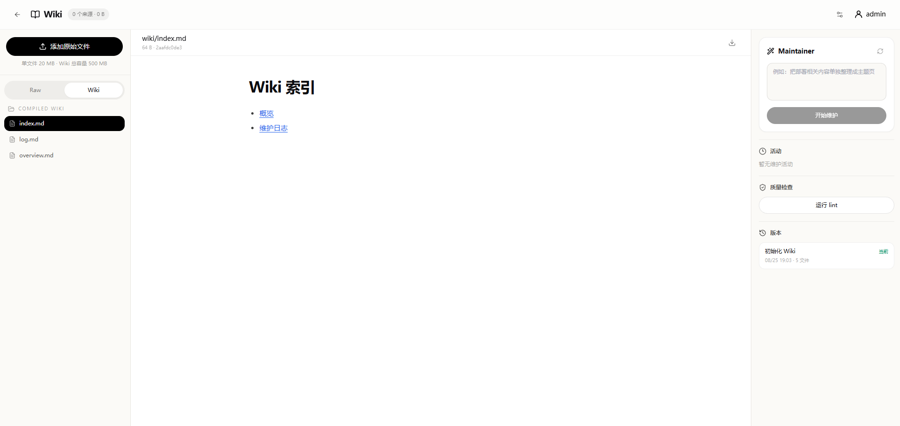

# Mira

Mira 是一个由 Codex 驱动的 AI App 创建与运行平台：用一句自然语言描述需求，Agent 会完成规划并生成可运行的应用，用户可以直接试用、继续修改和再次运行。

> Mira 参考了 Google Opal 的产品思路，但不是 Google 官方项目，也与 Google 无官方关联。

## Mira 解决什么问题

创建一个 AI 应用，不应该从学习节点、连线和执行规则开始。Mira 把这些结构交给 Agent 处理，让用户专注于自己真正想完成的事情：

```text
描述一句需求
    ↓
Agent 自动规划
    ↓
生成可运行的应用
    ↓
直接试用并查看结果
    ↓
用自然语言继续修改
    ↓
再次运行
```

在 Mira 中，用户拥有和操作的是 **App**，而不是一张工作流图。节点、执行边、运行线程和输出契约仍然存在，但它们主要作为系统内部的可靠执行模型；需要精确控制或排查问题时，也可以通过高级结构视图和运行记录查看。

## 核心体验

- **自然语言创建**：输入目标，也可以附带需求文档或截图；Agent 先生成可确认的计划，再把需求转成可运行的 AI App。关键信息不足时，Codex 会在规划阶段直接提问。
- **围绕结果持续修改**：先运行和预览，再用自然语言说明需要增加、删除或调整的内容；Mira 在现有应用上继续修改，而不是要求用户重新搭建流程。
- **应用即用即跑**：应用提供独立运行入口，支持中段交互、历史结果回放、HTML 预览和文件产物下载，也适配手机端使用。
- **复杂度由系统承担**：Mira 在内部使用结构化执行图组织输入、素材、生成、条件和输出，支持依赖驱动并发、运行快照、中断恢复和检查点重新执行。
- **Codex 隔离运行**：Codex App Server 只在 Docker sandbox 中运行。一次应用运行由一个逻辑 RunAgent 持续推进，线性步骤复用同一 thread 和 workspace，只有真实分支才创建隔离的 branch。
- **结果可验证**：支持自由文本、内部结构化 JSON 契约、HTML 和文件产物；正式产物经过类型、路径、大小和 SHA-256 完整性验证后才提供下载。
- **创建之后还能分享**：应用可以保留为私有项目，也可以公开运行或允许他人克隆；应用、运行数据和文件按用户隔离。
- **长期 Wiki**：每个用户拥有独立文件空间。Mira Maintainer 把可解析来源整理成 Markdown Wiki；工作流按需读取冻结的只读版本，不做 embedding、向量检索或自动回写。

## 产品界面

### 创建、管理和发现应用

从自己的应用库继续工作，或从应用市场选择模板开始。


### 直接运行生成的应用

应用拥有独立运行入口。用户只需要提供本次输入，不必理解它背后的执行结构。


### 查看结果和历史运行

每次运行都保留快照、结果与正式文件，可以回看历史输出，也可以从检查点创建新的运行。


### 在需要时查看执行结构

节点编辑器是 Agent 生成应用时使用的高级结构视图，用于理解执行计划、进行精确调整和排查复杂问题；它不是创建应用的必要前提。


### 在手机端运行

已创建的应用可以通过适配手机端的入口随时运行。


### 管理长期 Wiki

桌面端首页顶部可进入 Wiki，上传原始资料、查看自动维护活动、运行结构检查并恢复历史版本。普通工作流自动使用当前用户的 Wiki；运行第三方应用时，Mira 会在首次读取前请求授权，拒绝后仍可不挂载 Wiki 运行。



## 为什么底层仍然使用结构化执行模型

自然语言负责表达意图，结构化执行模型负责让应用稳定工作。Mira 在创建应用时把 Agent 的规划固化为可验证的运行结构，因此可以：

- 重复运行同一个应用，而不是每次依赖临场发挥；
- 明确输入、条件、输出和直接前置依赖；
- 冻结每次运行使用的应用版本；
- 在失败后定位阶段、恢复执行或从检查点重跑；
- 对 HTML、JSON 和文件产物执行强契约与完整性校验；
- 在公开运行应用时隐藏内部提示词、图结构和运行日志。

这使 Mira 同时具备自然语言产品的低门槛，以及工作流运行系统的可重复、可恢复和可验证。

## 使用 Codex 启动项目

建议使用能够读取文件并执行终端命令的 Codex。让它先完整阅读根目录 [`AGENTS.md`](AGENTS.md)，再按照其中的项目规则、必读文件和运行要求完成环境检查与启动。

可以直接告诉 Codex：

```text
请先完整阅读根目录 AGENTS.md，并继续阅读其中要求的前后端专项规则和必读文件。
检查本机的 Node.js、npm、Python 3.11+、uv 和 Docker 环境，为本地开发准备必要配置，
然后按项目约定启动 Mira。需要管理员密码等用户配置时先询问我，不要使用占位值，
也不要在宿主机直接运行 Codex。完成后告诉我访问地址和任何启动失败原因。
```

项目正常启动后的默认地址：

```text
前端：http://localhost:5173
后端：http://localhost:8000
API 文档：http://localhost:8000/api/docs
```

## 技术栈

- 前端：React、Vite、TypeScript、Tailwind CSS、Zustand、React Flow
- 后端：FastAPI、SQLAlchemy、Pydantic、SQLite、Alembic
- Runtime：Docker sandbox、Codex App Server

## License

[MIT](LICENSE)
