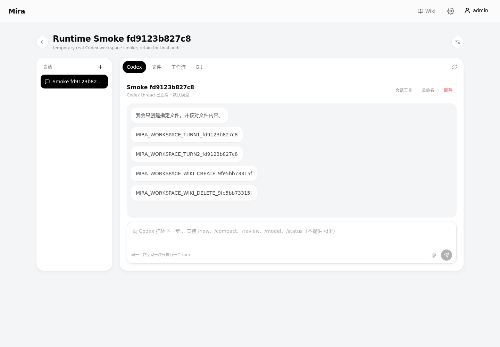

# Mira

Mira 是 **Codex 的可视化工作流层**。它把 Codex 原本隐藏在对话和执行过程中的复杂任务规划，转换成可查看、可理解、可干预、可重复运行的结构化工作流。

> **Codex 负责思考和执行，Mira 把 Codex 的工作流摊出来，让你能看、能改、能重跑。**

Codex 本身已经能够完成大量 AI 应用和复杂任务。Mira 的重点不是再造一个 AI App 生成器，而是让这些任务不再只存在于一次对话里：任务如何拆分、步骤如何衔接、哪里需要判断、执行到了哪里，都可以被呈现并保留下来。AI App 是工作流的保存、运行和分享形态，而不是 Mira 的核心差异。

> Mira 参考了 Google Opal 的产品思路，但不是 Google 官方项目，也与 Google 无官方关联。

## Mira 解决什么问题

在普通的 Codex 对话中，Codex 可以规划并完成复杂任务，但规划通常混在对话、工具调用和执行过程里。任务越长、分支越多，就越难快速回答这些问题：

- Codex 准备分几步完成任务？
- 当前执行到哪里，为什么走这条路径？
- 哪一步需要人工确认或精确调整？
- 如何保留已经完成的工作，只重跑需要修改的部分？

Mira 把这层过程转换成结构化工作流：

```text
描述目标
    ↓
Codex 规划任务
    ↓
Mira 展开为节点、连接和条件
    ↓
查看、理解和调整工作流
    ↓
Codex 按工作流持续执行
    ↓
查看结果、介入决策或从检查点重跑
```

用户不需要先学习节点和连线。可以从一句自然语言开始，让 Codex 生成可确认的计划和工作流；也可以进入可视化编辑器，直接调整节点、执行顺序、条件分支和提示词。保存后的工作流以 **App** 的形式运行和分享。

## 核心体验

- **把规划变成可视结构**：Mira 用输入、素材、生成、条件和输出节点表达任务阶段，用执行边和条件分支表达控制流。自然语言仍是起点，但规划结果不再只停留在对话里。
- **看懂 Codex 正在做什么**：节点图展示任务如何拆分，运行记录展示实际执行路径、步骤状态和结果，复杂任务不再是不可见的单次过程。
- **在关键位置介入**：既可以用自然语言继续修改现有工作流，也可以精确调整节点、连接、条件和提示词；执行到需要决策的位置时，Codex 可以暂停并向用户提问。
- **重复运行，而不是重新开始**：每次运行冻结工作流快照并保留历史结果。用户可以重新运行整个工作流，也可以从指定节点前的检查点创建新运行，复用此前状态并只执行该节点及下游。
- **让 Codex 保持连续工作**：一次运行由一个逻辑 RunAgent 持续推进。线性步骤复用同一 Codex thread 和 workspace；只有真实分支才创建隔离的 branch，并在汇合时由协调 Agent 合并。
- **隔离执行环境**：Codex App Server 只在 Docker sandbox 中运行，应用、运行数据和文件按用户隔离。
- **结果可验证**：支持自由文本、内部结构化 JSON 契约、HTML 和文件产物；正式产物经过类型、路径、大小和 SHA-256 完整性验证后才提供下载。
- **把工作流交付为 App**：工作流拥有独立运行入口，支持文本和文件输入、HTML 预览、文件下载与手机端使用；可以保持私有，也可以公开运行或允许他人克隆。
- **长期 Wiki**：每个用户拥有独立文件空间。Mira Maintainer 把可解析来源整理成 Markdown Wiki；工作流按需读取冻结的只读版本，不做 embedding、向量检索或自动回写。
- **持久工作空间**：每个私有 Workspace 都有长期项目目录、多个 Codex 会话和一个常驻 Docker runtime。它可以安全地读写项目文件、同步 Wiki，并通过人工确认的提案创建或修改可视化工作流。

## 产品界面

### 展开并编辑 Codex 工作流

可视化编辑器呈现 Codex 生成的任务结构。用户可以查看节点、连接和条件分支，也可以用自然语言或直接编辑的方式继续调整。


### 直接运行保存的工作流

工作流以 App 的形式提供独立运行入口。使用者只需要提供本次输入，Codex 会按已经确认的结构推进任务。


### 查看执行过程并从检查点重跑

每次运行都保留工作流快照、步骤状态、结果与正式文件。用户可以回看历史输出，也可以从指定节点前的检查点创建新运行。


### 创建、管理和发现工作流 App

从自己的应用库继续编辑和运行工作流，或从应用市场选择模板开始。


### 在手机端运行

已创建的应用可以通过适配手机端的入口随时运行。


### 管理长期 Wiki

桌面端首页顶部可进入 Wiki，上传原始资料、查看自动维护活动、运行结构检查并恢复历史版本。普通工作流自动使用当前用户的 Wiki；运行第三方应用时，Mira 会在首次读取前请求授权，拒绝后仍可不挂载 Wiki 运行。


### 在持久工作空间中使用 Codex

首页“工作空间”把 Codex 的项目会话、文件、运行状态、Wiki 同步和工作流提案放到同一个 Web 界面。一个工作空间可以保留多个会话，但同一时间只执行一个 turn；桌面和手机都可以继续会话、回答问题、取消执行、预览或下载文件。对话可以按需查询并调用当前用户有权限运行的可视化工作流，工作流需要用户确认时会沿用当前对话提问；执行继续使用正式 Run、Step、Decision 和 Artifact 链路，完成后的结果与文件会回到工作空间。



## Mira 如何承载 Codex 的工作流

自然语言负责表达目标，Codex 负责规划、推理和执行，Mira 负责把任务组织成可观察、可控制的运行结构：

- 重复运行同一个应用，而不是每次依赖临场发挥；
- 明确输入、条件、输出和直接前置依赖；
- 冻结每次运行使用的应用版本；
- 查看实际执行路径，在关键节点补充决策；
- 在失败或修改后定位阶段、恢复执行或从检查点重跑；
- 对 HTML、JSON 和文件产物执行强契约与完整性校验；
- 在公开运行应用时隐藏内部提示词、图结构和运行日志。
- 在私有持久 Workspace 中继续 Codex 项目，同时以 Wiki revision 和 WorkflowProposal 门禁连接长期知识与正式工作流。

结构化工作流没有取代 Codex 的自主能力，而是为它增加了一层用户能够理解和操作的边界：Codex 仍然负责完成工作，Mira 让这项工作可见、可改、可重跑。

## 使用 Codex 启动项目

建议使用能够读取文件并执行终端命令的 Codex。让它先完整阅读根目录 [`AGENTS.md`](AGENTS.md)，再按照其中的项目规则、必读文件和运行要求完成环境检查与启动。

可以直接告诉 Codex：

```text
请先完整阅读根目录 AGENTS.md，并继续阅读其中要求的前后端专项规则和必读文件。
检查本机的 Node.js、npm、Python 3.11+、uv 和 Docker 环境，为本地开发准备必要配置，
然后按项目约定启动 Mira。需要管理员密码等用户配置时先询问我，不要使用占位值，
也不要在宿主机直接运行 Codex。完成后告诉我访问地址和任何启动失败原因。
```

项目正常启动后的默认地址：

```text
前端：http://localhost:5173
后端：http://localhost:8000
API 文档：http://localhost:8000/api/docs
```

## 技术栈

- 前端：React、Vite、TypeScript、Tailwind CSS、Zustand、React Flow
- 后端：FastAPI、SQLAlchemy、Pydantic、SQLite、Alembic
- Runtime：Docker sandbox、Codex App Server

## License

[MIT](LICENSE)
