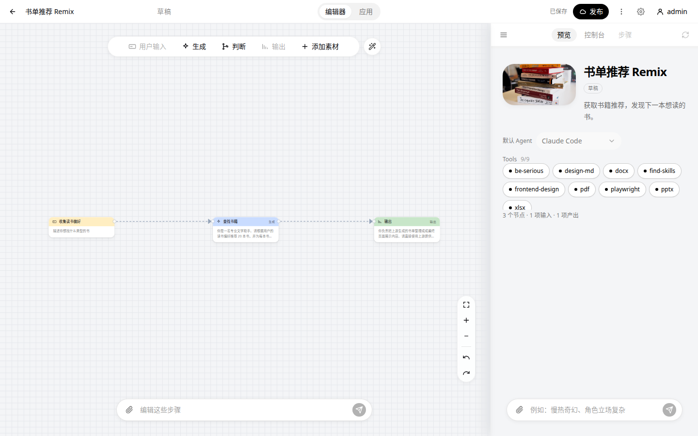
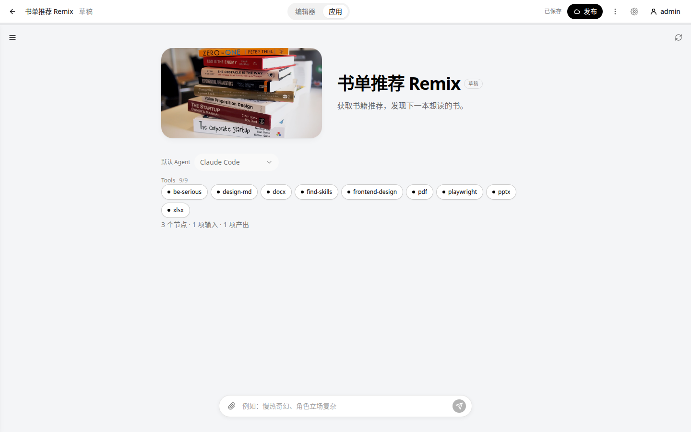
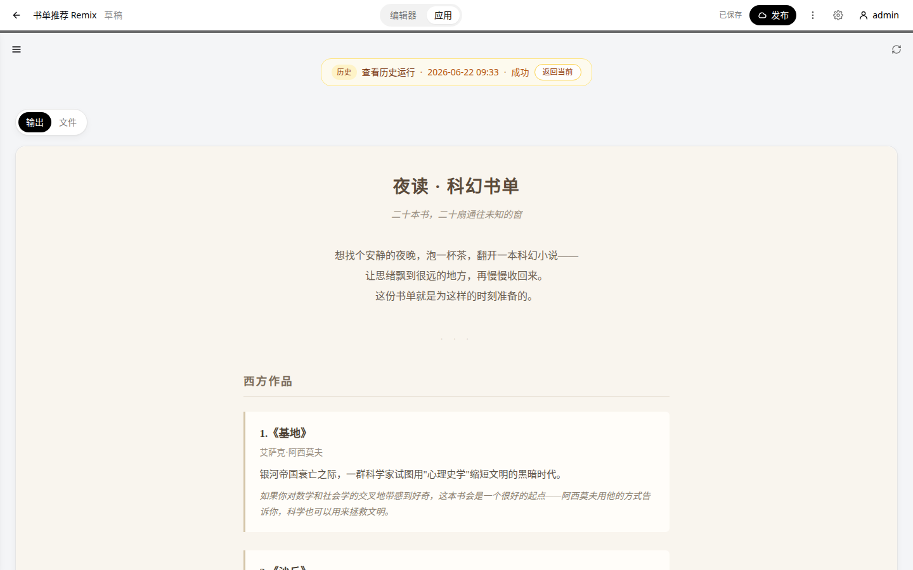
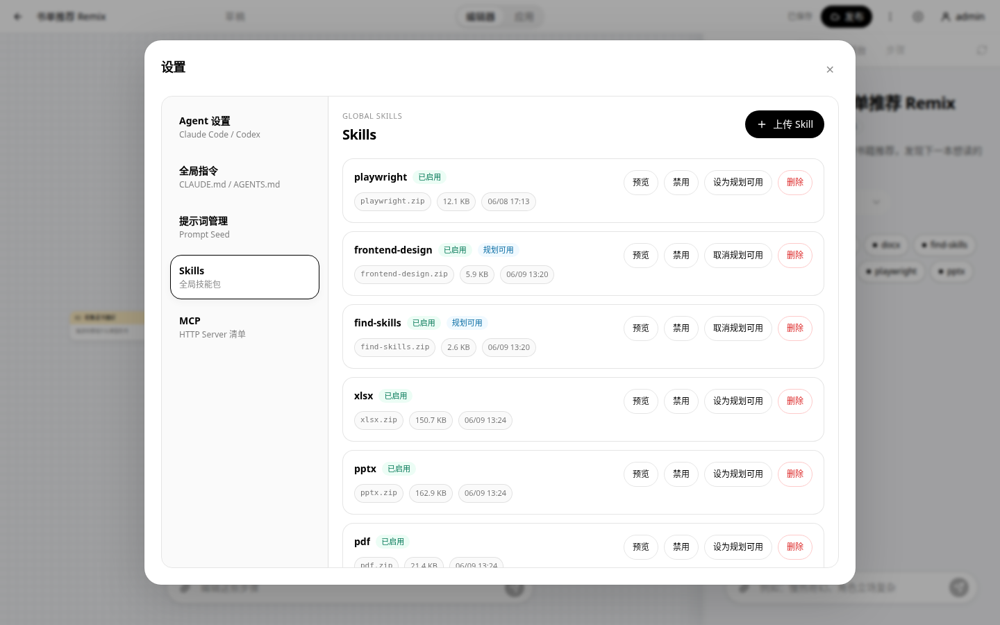
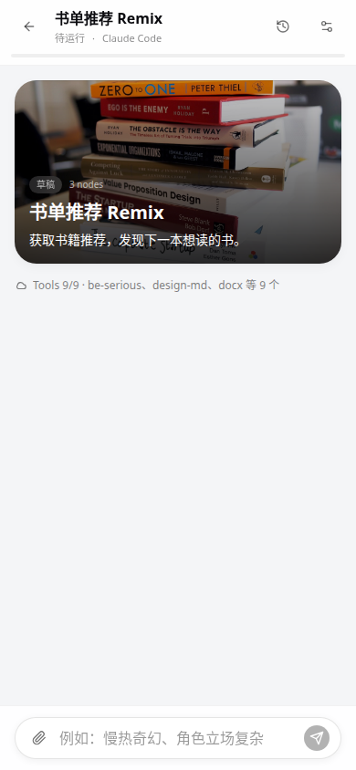

# Mira

Mira 是一个参考 Google Opal 思路的可视化 AI App 搭建与运行项目。它将自然语言编辑、节点工作流、Agent runtime、运行预览和中段交互组合在一起，用于快速构建可运行、可分享的 mini AI app。

> Mira 不是 Google 官方项目，也不隶属于 Google。Google Opal 是 Google 的产品或实验名称；本项目仅参考其产品思路进行复刻和优化。

## 项目特点

- **自然语言搭建应用**：可在首次指令中附带需求文档或截图，通过 Agent 生成或调整工作流，先确认方案再应用修改，关键信息不足时可通过 `ask_user` 继续澄清。
- **可视化执行工作流**：使用输入、素材、生成、条件和输出节点组织执行顺序；一次运行由一个 RunAgent 在共享会话与 workspace 中持续推进，无需为上下游数据引用绘制大量交叉连线，并支持 AI 布局、撤销重做和节点级 Prompt Assistant。
- **隔离的 Codex runtime**：Codex App Server 只在 Docker sandbox 中运行；线性节点延续同一 thread 与 workspace，真正并行时才通过 `thread/fork` 创建分支 thread 与 CoW workspace，汇合时由协调 Agent 合并分支。
- **可靠的运行与调试**：支持依赖驱动并发、强输出契约、workspace checkpoint、SSE 流式事件、运行快照、Trace、历史回放、中断恢复和从检查点重新执行。
- **多种输出形式**：支持自由文本、内部结构化 JSON 契约、HTML 预览和可下载文件产物；复杂 JSON Schema 由 AI 维护，不暴露给普通用户编辑。
- **完整的应用使用链路**：包含应用市场、公开运行或克隆、用户数据隔离，以及适配手机端的应用运行入口。

## 使用 AI 启动项目

建议将仓库交给能够读取文件并执行终端命令的 AI 编程助手，让它先完整阅读根目录 [`AGENTS.md`](AGENTS.md)，再根据其中的项目规则、必读文件和运行要求完成环境检查与启动。

可以直接告诉 AI：

```text
请先完整阅读根目录 AGENTS.md，并继续阅读其中要求的前后端专项规则和必读文件。
检查本机的 Node.js、npm、Python 3.11+、uv 和 Docker 环境，为本地开发准备必要配置，
然后按项目约定启动 Mira。需要管理员密码等用户配置时先询问我，不要使用占位值，
也不要在宿主机直接运行 Codex。完成后告诉我访问地址和任何启动失败原因。
```

项目正常启动后的默认地址：

```text
前端：http://localhost:5173
后端：http://localhost:8000
API 文档：http://localhost:8000/api/docs
```

## 技术栈

- 前端：React、Vite、TypeScript、Tailwind CSS、Zustand、React Flow
- 后端：FastAPI、SQLAlchemy、Pydantic、SQLite、Alembic
- Runtime：Docker sandbox、Codex App Server

## 功能截图

### 首页与应用市场


### 可视化工作流编辑器



### 独立应用运行页



### 历史运行结果回放



### Skills 与规划工具设置



### 手机端运行入口



## License

[MIT](LICENSE)
