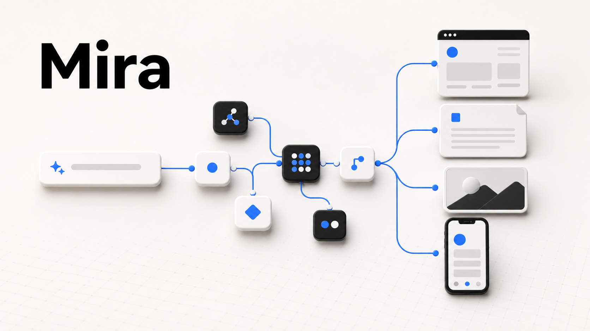

# 阮一峰科技爱好者周刊 · Mira 开源自荐草稿

> 状态：等待人工审批。本文档仅用于审稿，当前不创建 GitHub Issue。

## Issue 标题

【开源自荐】Mira：用自然语言和可视化工作流搭建 AI 小应用

## Issue 正文

Mira 是一个开源的可视化 AI App 搭建与运行项目，受 Google Opal 的可视化编排思路启发，把自然语言编辑、节点工作流、Agent runtime 和运行预览放进同一个工作区。

用户可以直接描述想做的应用。Mira 会先生成一份可确认的实施方案，再把方案转换成可编辑、可运行的节点工作流。工作流中的节点可以配置提示词、模型、推理等级、Skills 和 MCP，并通过连线传递结构化结果与文件。

它可以把资料整理、内容生成、文件处理、条件判断和多阶段交互组合成可重复运行的 AI 小应用，主要功能包括：

- 自然语言创建、调整工作流，并在应用修改前确认方案
- 可视化节点编排、条件分支和按依赖并行执行
- Codex Agent runtime
- 运行过程中的提问与补充信息交互
- 文本、JSON、HTML、图片、Office 文档和压缩包等输出
- 实时运行预览、执行轨迹、历史回放和节点级重新运行
- 应用发布、克隆、市场展示和手机端运行

Mira 使用 React、FastAPI 和 Docker 构建，采用 MIT 协议开源。

项目地址：https://github.com/sunflower9264/mira

## Issue 配图顺序

发布时建议将以下图片依次拖入 GitHub Issue 编辑器，由 GitHub 生成图片链接：

1. 封面：`docs/drafts/assets/mira-weekly-cover.png`
2. 工作流编辑器：`docs/screenshots/workflow-editor.png`
3. 运行结果与历史回放：`docs/screenshots/run-preview-trace.png`

可选补图：手机端运行界面 `docs/screenshots/mobile-run.png`。

### 图片预览




## 发布前人工确认

- 确认 Issue 标题和正文表述
- 确认 GitHub 项目地址
- 决定是否加入在线体验地址
- 将三张正式配图上传到 Issue，并检查显示顺序
- 预览无误后再提交 Issue

## 调研备注（不复制到 Issue）

- 投稿入口与项目说明：https://github.com/ruanyf/weekly
- 短而完整的软件自荐参考：https://github.com/ruanyf/weekly/issues/10956
- 极简自荐参考：https://github.com/ruanyf/weekly/issues/9965
- 带产品截图的自荐参考：https://github.com/ruanyf/weekly/issues/9547
- 功能列表与截图结合的参考：https://github.com/ruanyf/weekly/issues/10489

## 封面生成说明

- 用途：GitHub Issue 开源自荐封面
- 画面：自然语言输入连接可视化节点，并输出网页、文档、图片和手机端应用
- 风格：暖白背景、黑白灰主体、克制的蓝色强调、现代开发工具视觉
- 封面由 AI 生成，实际产品界面以两张真实截图为准

最终生成提示词：

```text
Use case: ads-marketing
Asset type: open-source project recommendation cover for a GitHub Issue
Create a polished landscape cover for Mira, an open-source visual AI app builder. A short natural-language prompt flows left-to-right into a clean connected workflow graph, which branches into four useful outputs shown as simple visual objects: a web page, a document, an image, and a mobile app preview. Minimal off-white workspace with subtle depth. Refined editorial 3D illustration combined with crisp product-diagram aesthetics and a modern developer-tool visual language. Wide landscape composition, central graph, generous whitespace, soft studio lighting. Black, warm white, soft gray, and restrained blue accents.
Text (verbatim): "Mira"
Spell Mira exactly once. No other readable text. No detailed fake UI. No Google logo. No extra brand marks. No watermark. No slogans. Avoid neon cyberpunk styling.
```
